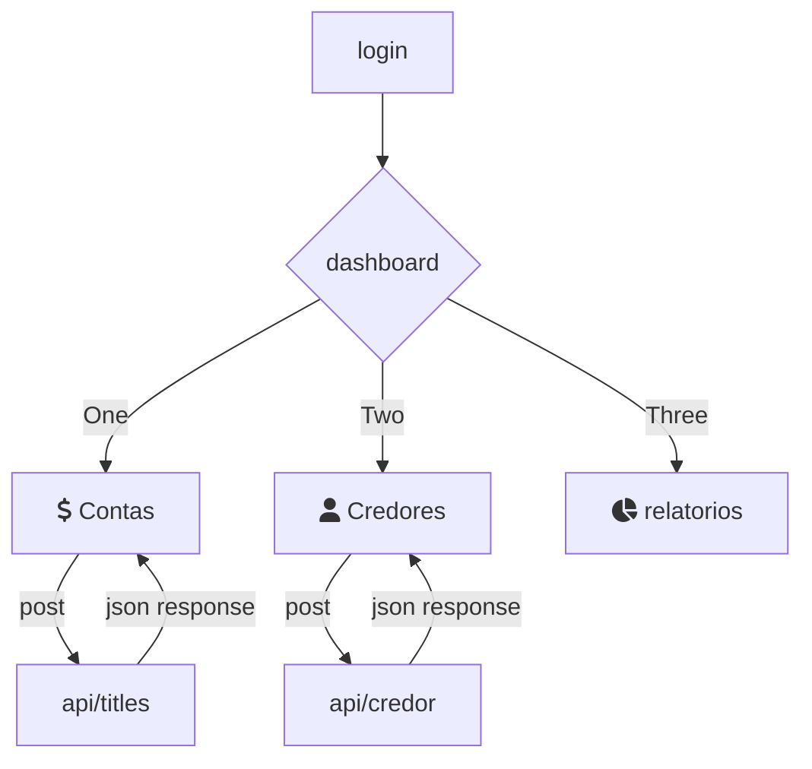

# Estrutura do projeto :

```
    ├── instance  #pasta onde se encontra o arquivo .db que serve de database para o sqlite
    ├── models    #contem os modelos sqlalchemy responsaveis por criar e manipular a db
    ├── routes    #contem as rotas , responsavel por definir as urls do site
    ├── static    #pasta com arquivos responsaveis pelo frontend
    │  ├── css    #os arquivos aqui dentro definem a aparencia do site
    │  ├── fonts  #fontes ttf se encontram aqui , responsaveis pela aparencia de alguns icones utilizando boxicons
    │  ├── js     #contem os arquivos javascript do site
    │  └── svg    #svgs do boxicons
    └── templates #pasta onde se encontra os arquivos html que servem de modelo para o site
```
esquema atual :

<br>
<br>

# Guia de Instalação e Execução de um App Flask com Flask-SQLAlchemy

Este guia fornece instruções passo a passo para configurar e executar um aplicativo Flask com Flask-SQLAlchemy usando `virtualenv` em sistemas Windows e Linux.

## Pré-requisitos

Certifique-se de que você tenha o Python instalado em seu sistema. Você pode verificar isso executando `python --version` ou `python3 --version` no terminal ou prompt de comando.

## Passo a Passo para Windows

### 1. Clone o Repositório

1. Abra o Prompt de Comando (cmd) ou PowerShell.
2. Navegue até o diretório onde deseja clonar o repositório.

    ```bash
    cd caminho\para\o\diretório
    ```

3. Clone o repositório usando Git.

    ```bash
    git clone https://github.com/PabloBF/Kyo.git
    ```

4. Navegue para o diretório do projeto clonado.

    ```bash
    cd Kyo
    ```

### 2. Crie e Ative um Ambiente Virtual

1. Crie um ambiente virtual usando `virtualenv`.

    ```bash
    python -m venv venv
    ```

2. Ative o ambiente virtual.

    ```bash
    venv\Scripts\activate
    ```

### 3. Instale Dependências

1. Com o ambiente virtual ativado, instale Flask e Flask-SQLAlchemy.

    ```bash
    pip install Flask Flask-SQLAlchemy
    ```

2. (Opcional) Se você tiver um arquivo `requirements.txt`, você pode instalar todas as dependências listadas nele.

    ```bash
    pip install -r requirements.txt
    ```

### 4. Execute o Aplicativo

1. Com o ambiente virtual ativado e no diretório do projeto, execute o aplicativo.

    ```bash
    python app.py
    ```

2. Abra seu navegador e acesse `http://127.0.0.1:5000` para ver o aplicativo em execução.

## Passo a Passo para Linux

### 1. Clone o Repositório

1. Abra um terminal.
2. Navegue até o diretório onde deseja clonar o repositório.

    ```bash
    cd caminho/para/o/diretório
    ```

3. Clone o repositório usando Git.

    ```bash
    git clone https://github.com/PabloBF/Kyo.git
    ```

4. Navegue para o diretório do projeto clonado.

    ```bash
    cd Kyo
    ```

### 2. Crie e Ative um Ambiente Virtual

1. Crie um ambiente virtual usando `virtualenv` ou `venv`.

    ```bash
    python3 -m venv venv
    ```

2. Ative o ambiente virtual.

    ```bash
    source venv/bin/activate
    ```

### 3. Instale Dependências

1. Com o ambiente virtual ativado, instale Flask e Flask-SQLAlchemy.

    ```bash
    pip install Flask Flask-SQLAlchemy
    ```

2. (Opcional) Se você tiver um arquivo `requirements.txt`, você pode instalar todas as dependências listadas nele.

    ```bash
    pip install -r requirements.txt
    ```

### 4. Execute o Aplicativo

1. Com o ambiente virtual ativado e no diretório do projeto, execute o aplicativo.

    ```bash
    python app.py
    ```

2. Abra seu navegador e acesse `http://127.0.0.1:5000` para ver o aplicativo em execução.
